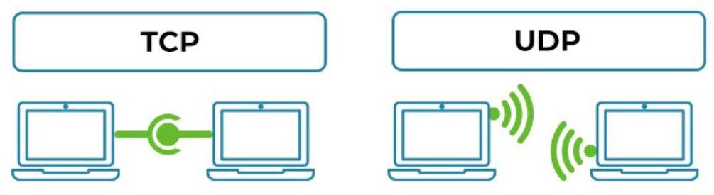

# TCP vs UDP: The Key to Understanding Network Communication

Communication is the backbone of our interconnected world. Whether you're streaming your favorite show, sending a message, or gaming online, you're relying on network protocols to get the job done. Two of the most common communication protocols in computer networking are TCP (Transmission Control Protocol) and UDP (User Datagram Protocol). Let’s explore their differences and understand where and why each is used.

## What is TCP (Transmission Control Protocol)?

TCP is a connection-oriented protocol, meaning it establishes a reliable connection between sender and receiver before data transmission begins. It ensures that all packets are delivered in the correct order and without errors.

### Key Features of TCP:
- Reliable delivery: Guarantees delivery of data.
- Ordered packets: Maintains the order of messages.
- Error checking: Performs error detection and correction.
- Flow & congestion control: Manages data transfer rates to avoid congestion.

### Use Cases:
- Web browsing (HTTP/HTTPS)
- Emails (SMTP, IMAP, POP3)
- File transfers (FTP)

## What is UDP (User Datagram Protocol)?

UDP is a connectionless protocol. It sends data without establishing a connection and does not guarantee delivery, order, or error checking. It's fast and efficient when reliability is not a top priority.

### Key Features of UDP:
- Low latency: Minimal delay in transmission.
- No guarantee of delivery/order.
- Lightweight: Less overhead compared to TCP.

### Use Cases:
- Online gaming
- Live video/audio streaming
- VoIP (Voice over IP)
- DNS lookups

## TCP vs UDP: Head-to-Head Comparison

| Feature     | TCP                        | UDP                        |
|-------------|-----------------------------|-----------------------------|
| Connection  | Connection-oriented         | Connectionless              |
| Reliability | Reliable (acknowledgments)  | Unreliable (no acknowledgments) |
| Order       | Maintains packet order      | No guarantee of order       |
| Speed       | Slower due to overhead      | Faster with minimal delay   |
| Use Cases   | Web, emails, file transfer  | Streaming, gaming, VoIP     |
| Overhead    | Higher                      | Lower                       |

## Conclusion

Choosing between TCP and UDP depends on your application’s needs. If you need reliable and ordered data delivery, TCP is your best bet. If you prioritize speed over reliability, especially in real-time scenarios, UDP shines.

Understanding both protocols helps you make better decisions in network design and application development.

Written by Shreya Wani

Published on Hashnode: 
https://tcp-vs-udp-explained.hashnode.dev/tcp-vs-udp-the-key-to-understanding-network-communication